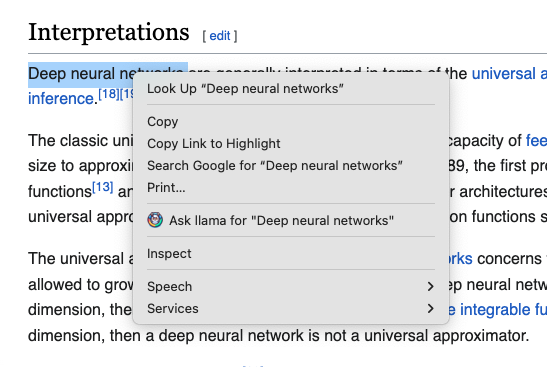
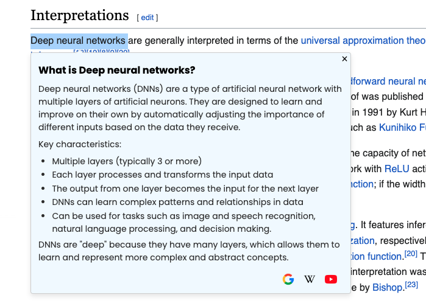
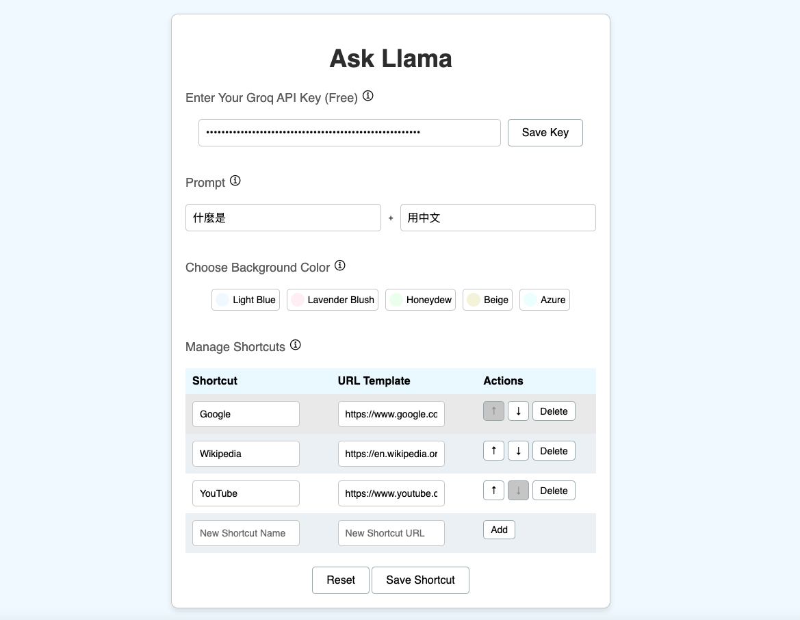

# Ask Llama Chrome Extension


Right click to ask Llama about the selected words. Supported by Groq and powered by Marked.js.

## Features

- **One-click AI search**: Right-click selected text to ask Llama.
- **Enhance reading with tooltips**: Tooltips appear on the page and display answers from Llama.
- **Customizable shortcuts**: Enable additional searches using predefined or custom shortcuts.

We use the `llama3-70b-8192` model.

## Installation

1. Clone the repository:
    ```sh
    git clone https://github.com/yourusername/ask-llama-extension.git
    ```
    Or Download ZIP (unzip it).

2. Open Chrome and navigate to `chrome://extensions/`.

3. Enable "Developer mode" by toggling the switch in the top-right corner.

4. Click "Load unpacked" and select the directory (ask-llama-extension).

## Usage

1. Select any text on a webpage.
2. Right-click the selected text.
3. Click on the context menu item that says `Ask llama for "<selected text>"`.



4. A tooltip will appear with an answer from the LLM and options to search the text using different engines or custom shortcuts.



## Configuration
>[!IMPORTANT]
> You need to enter the Groq API key (free) to use this Chrome Extension.
>
> Follow the following instruction:
>
> 1. Register for a free account at [Groq](https://groq.com/).
> 2. Go to the [Groq Playground](https://console.groq.com/playground) and click on the "API Keys" in menu. And click "Create API Key" button.

To configure the extension, click on the extension icon in the toolbar. 
